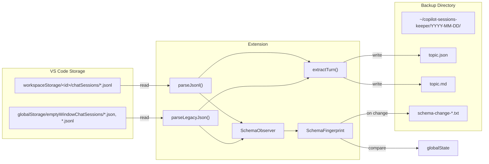

# Functional Specification: Copilot Sessions Keeper

**Version:** 0.1.0
**Status:** Draft
**Author:** vn

---

## 1. Purpose

Preserve GitHub Copilot chat sessions that VS Code silently prunes (keeping only ~40 recent turns per workspace). The extension exports sessions as structured JSON and human-readable Markdown on each first daily launch.

## 2. Scope

### In Scope

- Reading chat session data from VS Code's internal storage
- Exporting to JSON and Markdown
- Automatic daily trigger on activation
- Manual trigger via Command Palette
- Schema change detection and user notification
- Configurable backup directory

### Out of Scope

- Syncing backups to remote/cloud storage
- Editing or replaying sessions
- Backing up non-Copilot chat providers (e.g., Cline, Continue)
- Windows / Linux path support (future work)

## 3. Functional Requirements

### FR-1: Auto-Backup on First Daily Session

| Property | Value |
|----------|-------|
| Trigger | `onStartupFinished` activation event |
| Condition | `globalState.lastBackupDate !== today` |
| Behavior | Export all sessions, update `lastBackupDate`, show info notification |
| On failure | Show error notification, do not update `lastBackupDate` (retry on next activation) |

### FR-2: Manual Backup Command

| Property | Value |
|----------|-------|
| Command ID | `copilotSessionsKeeper.backupNow` |
| Behavior | Export all sessions immediately, show notification with count |
| Idempotency | Sessions already exported (folder exists) are skipped |

### FR-3: Session Discovery

The extension discovers sessions from two locations:

| Source | Path | Format |
|--------|------|--------|
| Workspace sessions | `workspaceStorage/<id>/chatSessions/*.jsonl` | JSONL append-log |
| Empty-window sessions | `globalStorage/emptyWindowChatSessions/*.json` | Legacy JSON |
| Empty-window sessions | `globalStorage/emptyWindowChatSessions/*.jsonl` | JSONL append-log |

### FR-4: Session Parsing

For each session the extension extracts:

- **Session ID** — UUID from the initialization entry
- **Title** — First string mutation in the JSONL log, or `customTitle` in legacy JSON
- **Creation date** — Timestamp from initialization entry
- **Workspace** — Resolved from `workspace.json` in the workspace storage directory
- **Turns** — List of user/assistant exchange pairs

Each turn contains:
- **User text** — From `message.parts[].text`
- **Assistant text** — Concatenated from response parts (markdown content, tool invocations, code edits, inline references)
- **Thinking** — Extended thinking blocks (kept separate for filtering)
- **Timestamp** — Request timestamp

### FR-5: Output Format

Each session is written to:

```
<backupDir>/YYYY-MM-DD/
    <topic-slug>.json    # Full-fidelity structured JSON (Session interface)
    <topic-slug>.md      # Human-readable Markdown with User/Assistant sections
```

Rules:
- Folder name is the session creation date (`YYYY-MM-DD`), or `undated` if no creation date
- Multiple sessions from the same date share one folder
- `topic-slug` is the title lowercased, non-alphanumeric chars replaced with `-`, max 80 chars
- If the `.json` file already exists, the session is skipped (idempotent)
- Backup directory is created recursively if needed

### FR-6: Schema Change Detection

On each export run, the extension:

1. Collects a **SchemaFingerprint** — the set of all observed JSONL entry kinds, object keys, and response part kinds
2. Compares against the stored fingerprint in `globalState`
3. On first run: stores baseline silently
4. On change: writes a diff report, shows a warning with three actions:
   - **Open Report** — Opens the diff file in the editor
   - **Accept New Schema** — Updates the stored baseline
   - **Dismiss** — Takes no action (will re-alert next run)

### FR-7: Configuration

| Setting | Type | Default | Description |
|---------|------|---------|-------------|
| `copilotSessionsKeeper.backupDir` | string | `""` (= `~/copilot-sessions-keeper`) | Output directory. Supports `~` prefix. |
| `copilotSessionsKeeper.enabled` | boolean | `true` | Enable/disable automatic daily backup |

## 4. Non-Functional Requirements

| Requirement | Target |
|-------------|--------|
| **Startup impact** | < 2s added to activation (file I/O only, no network) |
| **Disk usage** | Proportional to session count; ~5-50 KB per session (JSON + MD). Raw JSONL source files are 100 KB–15 MB each but the parsed output is much smaller. |
| **No native deps** | Pure Node.js file I/O; no native modules or SQLite needed |
| **Idempotency** | Safe to run multiple times; never overwrites existing backups |
| **Graceful degradation** | Corrupted or unreadable session files are skipped with a console warning |

## 5. Data Flow



## 6. Error Handling

| Scenario | Behavior |
|----------|----------|
| Session file missing or corrupt JSON | Skip file, log warning |
| Permission error reading storage | Skip file, log warning |
| Cannot create backup directory | Show error notification, abort run |
| Schema change detected | Show warning, write report, continue export |
| Zero sessions found | Log info, do not update `lastBackupDate` |
| File name collision (same date + slug) | Second session silently skipped — **known limitation** (see ADR-004). Two sessions with the same date and same title produce identical file names; only the first is exported. |

## 7. Future Considerations

- Cross-platform path resolution (Linux: `~/.config/Code/`, Windows: `%APPDATA%\Code\`)
- Incremental backup (track file modification times, skip unchanged)
- Session merging when same session is updated across runs
- File name collision avoidance (append session ID suffix when slug collides)
- Export to Obsidian vault format
- Configurable retention/pruning of old backups
