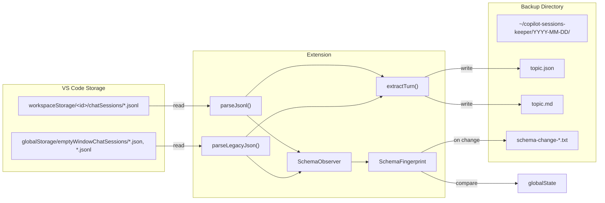

# Functional Specification: Copilot Sessions Keeper

**Version:** 0.1.0
**Status:** Draft
**Author:** vn

---

## 1. Purpose

Preserve GitHub Copilot chat sessions that VS Code silently prunes (keeping only ~40 recent turns per workspace). The extension exports sessions as structured JSON and human-readable Markdown on each first daily launch.

## 2. Scope

### In Scope

- Reading chat session data from VS Code's internal storage
- Exporting to JSON and Markdown
- Markdown output uses YAML frontmatter (Obsidian-compatible)
- Git repository remote URL resolution per workspace
- Automatic daily trigger on activation
- Manual trigger via Command Palette
- Schema change detection and user notification
- Configurable backup directory
- Optional JSON output (can be disabled to produce Markdown only)

### Out of Scope

- Syncing backups to remote/cloud storage
- Editing or replaying sessions
- Backing up non-Copilot chat providers (e.g., Cline, Continue)

## 3. Functional Requirements

### FR-1: Auto-Backup on First Daily Session

| Property | Value |
|----------|-------|
| Trigger | `onStartupFinished` activation event |
| Condition | `globalState.lastBackupDate !== today` |
| Behavior | Export all sessions, update `lastBackupDate`, show info notification |
| On failure | Show error notification, do not update `lastBackupDate` (retry on next activation) |

### FR-2: Manual Backup Command

| Property | Value |
|----------|-------|
| Command ID | `copilotSessionsKeeper.backupNow` |
| Behavior | Export all sessions immediately, show notification with count |
| Idempotency | Sessions already exported (folder exists) are skipped |

### FR-3: Session Discovery

The extension discovers sessions from two locations:

| Source | Path | Format |
|--------|------|--------|
| Workspace sessions | `workspaceStorage/<id>/chatSessions/*.jsonl` | JSONL append-log |
| Empty-window sessions | `globalStorage/emptyWindowChatSessions/*.jsonl` | JSONL append-log |
| Empty-window sessions (legacy) | `globalStorage/emptyWindowChatSessions/*.json` | Legacy JSON (no longer generated; retained for backward compat) |

### FR-4: Session Parsing

For each session the extension extracts:

- **Session ID** — UUID from the initialization entry
- **Title** — First string mutation in the JSONL log, or `customTitle` in legacy JSON
- **Creation date** — Timestamp from initialization entry
- **Workspace** — Resolved from `workspace.json` in the workspace storage directory
- **Git Remote** — Resolved by running `git remote get-url origin` in the workspace folder; normalized to HTTPS URL. Cached per workspace path for the duration of the export run. Omitted if the folder is not a git repo or has no `origin` remote.
- **Turns** — List of user/assistant exchange pairs

Each turn contains:
- **User text** — From `message.parts[].text`
- **Assistant text** — Concatenated from response parts (markdown content, tool invocations, code edits, inline references)
- **Thinking** — Extended thinking blocks (kept separate for filtering)
- **Timestamp** — Request timestamp

### FR-5: Output Format

Each session is written to:

```
<backupDir>/YYYY-MM-DD/
    <topic-slug>.json    # Full-fidelity structured JSON (optional, see outputJson setting)
    <topic-slug>.md      # Obsidian-compatible Markdown with YAML frontmatter
```

#### Markdown Format

The Markdown file uses YAML frontmatter for Obsidian compatibility:

```yaml
---
title: "Session Title"
session_id: "uuid-here"
date: 2026-04-16T10:30:00.000Z
workspace: "/Users/vn/ws/my-project"
git_remote: "https://github.com/user/my-project"   # only if resolved
---
```

The body contains turn sections with:
- Per-turn **timestamp** (italic ISO date)
- **User** section
- **Thinking** section (collapsible `<details>` block, only if present)
- **Assistant** section

YAML values are properly escaped (backslashes, quotes, newlines, tabs).

#### JSON Format

JSON output writes the full `Session` object with `JSON.stringify` (2-space indent). JSON output can be disabled via the `outputJson` setting.

#### Rules

- Folder name is the session creation date (`YYYY-MM-DD`), or `undated` if no creation date
- Multiple sessions from the same date share one folder
- `topic-slug` is the title lowercased, non-alphanumeric chars replaced with `-`, max 80 chars
- Idempotency check: if a `.json` or `.md` file already exists, the session ID is compared (via JSON parse or frontmatter `session_id` match). Same session → skip. When JSON is absent or corrupt, the Markdown frontmatter is used as fallback.
- If a different session has the same slug (collision), a `-<sessionId[:8]>` suffix is appended
- Backup directory is created recursively if needed

### FR-6: Schema Change Detection

On each export run, the extension:

1. Collects a **SchemaFingerprint** — the set of all observed JSONL entry kinds, object keys, and response part kinds
2. Merges the observed fingerprint into the stored one (monotonic union — keys only grow, never shrink)
3. On first run: stores baseline silently
4. On **additions only** (new keys/kinds never seen before): writes a diff report, shows a warning with two actions:
   - **Open Report** — Opens the diff file in the editor
   - **Dismiss** — Takes no action (the merged fingerprint is already stored)

Removals are intentionally ignored: a single export run may only parse a subset of sessions, so not every possible key will appear every time. The stored fingerprint represents the union of all keys ever observed.

### FR-7: Configuration

| Setting | Type | Default | Description |
|---------|------|---------|-------------|
| `copilotSessionsKeeper.backupDir` | string | `""` (= `~/copilot-sessions-keeper`) | Output directory. Supports `~` prefix. |
| `copilotSessionsKeeper.enabled` | boolean | `true` | Enable/disable automatic daily backup |
| `copilotSessionsKeeper.retentionDays` | number | `0` | Auto-delete backup folders older than N days. 0 = keep forever. |
| `copilotSessionsKeeper.outputJson` | boolean | `true` | Also write a JSON file for each session. When `false`, only Markdown is produced. |

### FR-8: Incremental Backup

| Property | Value |
|----------|-------|
| Mechanism | Track source file `mtimeMs` in `_metadata.json` inside the backup directory |
| Behavior | Skip parsing files whose mtime matches the stored value |
| Fallback | If `_metadata.json` is missing or corrupt, re-parse all files |

### FR-9: Retention Policy

| Property | Value |
|----------|-------|
| Trigger | After each backup run, if `retentionDays > 0` |
| Behavior | Delete `YYYY-MM-DD` folders older than the configured retention period |
| Exclusions | `undated` folder, `_metadata.json`, schema-change reports are never pruned |

## 4. Non-Functional Requirements

| Requirement | Target |
|-------------|--------|
| **Startup impact** | < 2s added to activation (file I/O only, no network) |
| **Disk usage** | Proportional to session count; ~5-50 KB per session (JSON + MD). Raw JSONL source files are 100 KB–15 MB each but the parsed output is much smaller. |
| **No native deps** | Pure Node.js file I/O; no native modules or SQLite needed |
| **Idempotency** | Safe to run multiple times; never overwrites existing backups |
| **Graceful degradation** | Corrupted or unreadable session files are skipped with a console warning |

## 5. Data Flow



## 6. Error Handling

| Scenario | Behavior |
|----------|----------|
| Session file missing or corrupt JSON | Skip file, log warning |
| Permission error reading storage | Skip file, log warning |
| Cannot create backup directory | Show error notification, abort run |
| Schema change detected | Show warning, write report, continue export |
| Zero sessions found | Log info, do not update `lastBackupDate` |
| File name collision (same date + slug) | Colliding session exported with `-<sessionId[:8]>` suffix appended to the slug |

## 7. Future Considerations

- Session merging when same session is updated across runs
- Syncing backups to cloud storage
- Obsidian tags / links derived from session content
